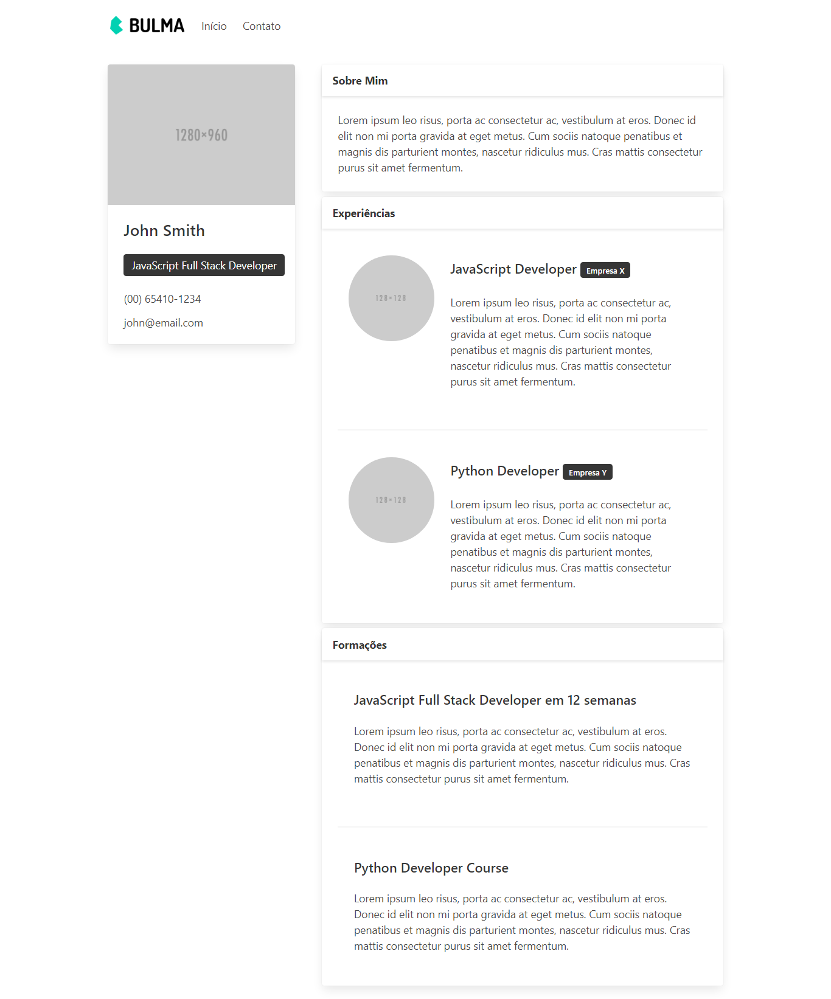
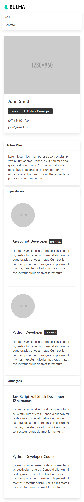

#  Portifólio Rápido com Bulma
*Objetivo do projeto:* Testar os conhecimentos de Bulma CSS e desenvolver um portifólio rápido do zero em poucos minutos.

Esse é um desafio rápido do curso de Fullstack com JavaScript.

## Sobre o Bulma
Basicamente ele é um framework CSS semelhante ao Bootstrap e o Materialize.

A diferença é que o Bulma é focado na construção de um layout responsivo.

Ele tem classes como `is-hidden-mobile` que permite tirar elementos na versão mobile e exibi-los apenas na versão desktop.

## Link do portfólio no github pages
https://matheussgomes.github.io/portfolio-com-bulma/

## Imagens do Projeto

